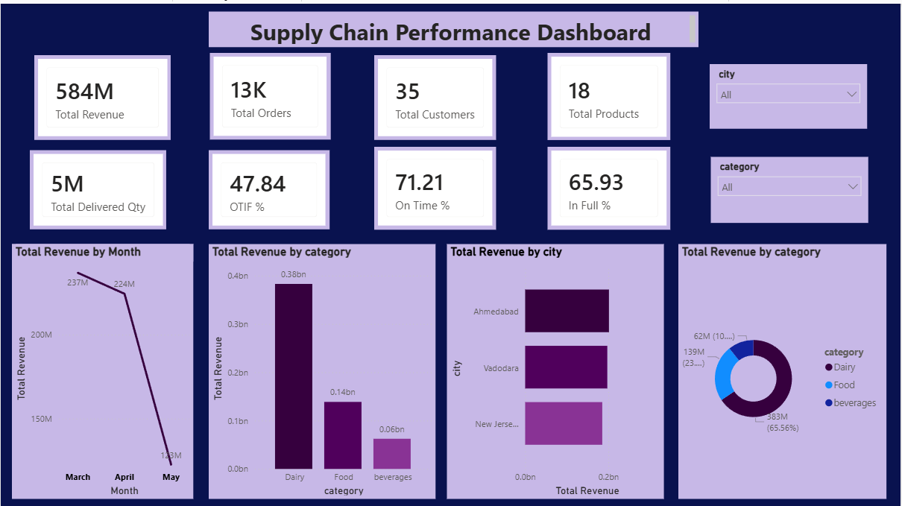
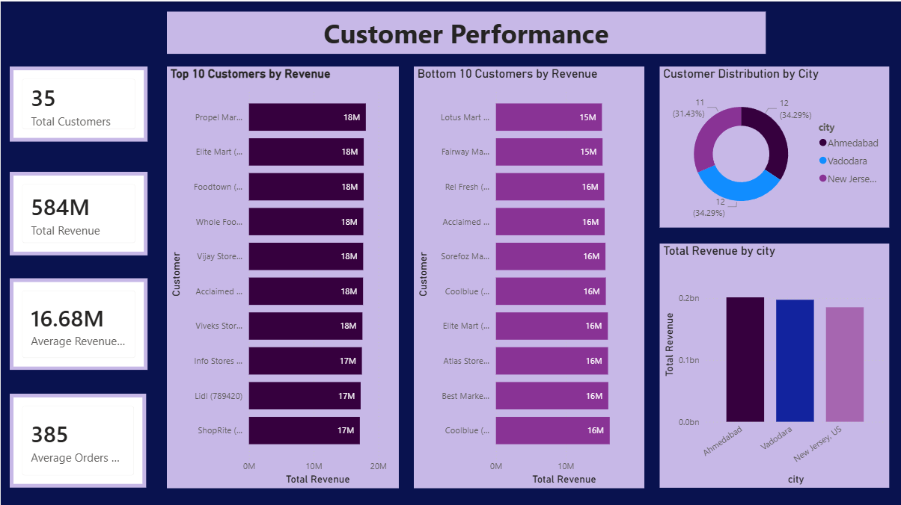
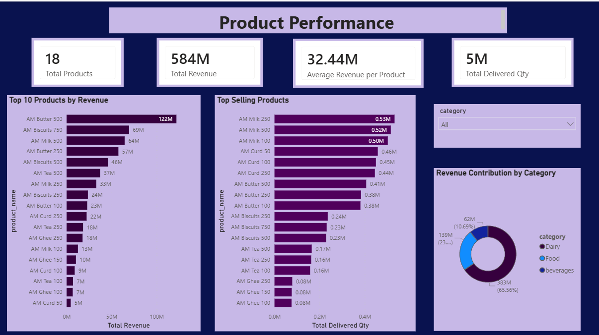
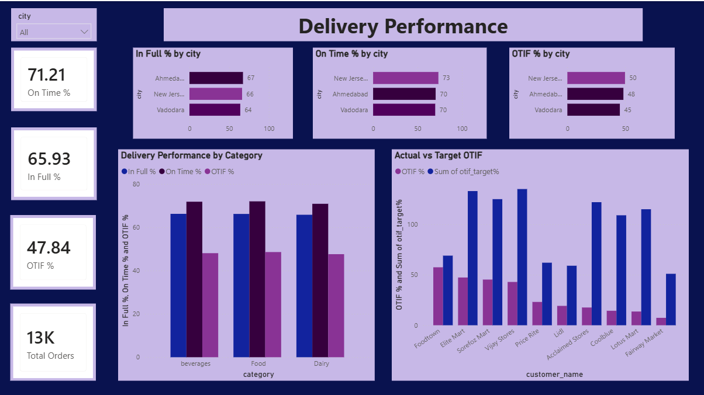
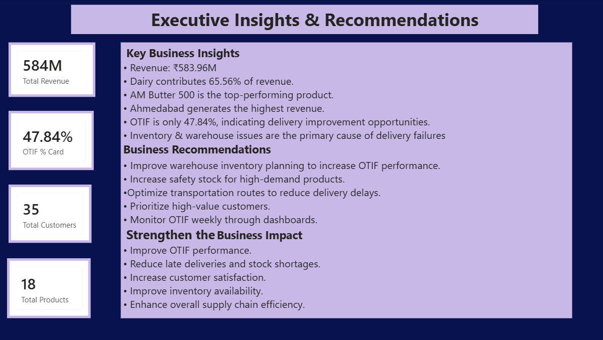

# 🚚 End-to-End Supply Chain Analytics Project

<p align="center">


</p>

---

# 📌 Project Overview

This project demonstrates an **end-to-end Supply Chain Analytics solution** built using **Python, SQL, SQLite, and Power BI**.

The objective was to transform raw operational data into meaningful business insights by performing:

- Data Cleaning
- Data Transformation
- Exploratory Data Analysis (EDA)
- KPI Calculation
- SQL Analytics
- Interactive Dashboard Development
- Executive Business Reporting

The project follows a complete analytics workflow that closely resembles a real-world business intelligence project.

---

# 🎯 Business Problem

Supply chain organizations generate massive volumes of operational data every day.

Business leaders require answers to questions such as:

- Which customers generate the highest revenue?
- Which products contribute most to sales?
- Which cities perform best?
- Are deliveries happening on time?
- Where are delivery failures occurring?
- Which operational areas require improvement?

This project answers these questions through data-driven analysis and visualization.

---

# 🛠 Tech Stack

| Category | Tools |
|-----------|----------------------------|
| Programming | Python |
| Database | SQLite |
| Query Language | SQL |
| Data Analysis | Pandas, NumPy |
| Visualization | Matplotlib |
| Dashboard | Power BI |
| Development | Jupyter Notebook |
| Version Control | Git & GitHub |

---

# 📂 Project Structure

```text
Supply-Chain-Analytics-Project
│
├── data
│   ├── CSV Files
│   └── SQLite Database
│
├── notebooks
│   ├── Data Loading
│   ├── Data Understanding
│   ├── Data Cleaning
│   ├── Data Merging
│   ├── EDA
│   ├── KPI Analysis
│   ├── SQL Analysis
│   └── Business Insights
│
├── dashboard
│   └── Supply_Chain_Dashboard.pbix
│
├── screenshot
│   ├── Executive Dashboard
│   ├── Customer Dashboard
│   ├── Product Dashboard
│   ├── Delivery Dashboard
│   └── Executive Insights
│
├── docs
│
├── README.md
└── requirements.txt
```

---

# 📊 Dashboard Preview

## Executive Dashboard



---

## Customer Performance



---

## Product Performance



---

## Delivery Performance



---

## Executive Insights



---

# 📈 Key Performance Indicators

| KPI | Value |
|------|-------:|
| Total Revenue | ₹583.96 Million |
| Total Orders | 13,467 |
| Order Lines | 24,195 |
| Customers | 35 |
| Products | 18 |
| Categories | 3 |
| Cities | 3 |
| On-Time Delivery | 71.21% |
| In-Full Delivery | 65.93% |
| OTIF | 47.84% |

---

# 📦 Revenue by Category

| Category | Revenue |
|-----------|---------:|
| Dairy | ₹382.83 Million |
| Food | ₹138.68 Million |
| Beverages | ₹62.45 Million |

---

# 📅 Monthly Revenue

| Month | Revenue |
|---------|-----------:|
| March | ₹236.93 Million |
| April | ₹224.45 Million |
| May | ₹122.58 Million |

---

# 🔍 SQL Analysis

The SQL analysis includes:

- Database Verification
- Revenue Analysis
- Customer Analysis
- Product Performance
- Delivery Performance
- Advanced SQL Queries
- KPI Calculation
- Business Insights

---

# 💡 Key Business Insights

- Dairy contributes over **65%** of total revenue.
- **AM Butter 500** is the highest revenue-generating product.
- **Propel Mart** is the top-performing customer.
- Ahmedabad generates the highest revenue.
- OTIF performance is **47.84%**, indicating significant room for operational improvement.
- Inventory and warehouse issues account for approximately **84%** of delivery failures.
- Transportation contributes around **16%** of delayed deliveries.

---

# 📈 Project Workflow

```text
Raw Data
      │
      ▼
Data Cleaning
      │
      ▼
Data Transformation
      │
      ▼
Exploratory Data Analysis
      │
      ▼
KPI Analysis
      │
      ▼
SQLite Database
      │
      ▼
SQL Analytics
      │
      ▼
Power BI Dashboard
      │
      ▼
Business Insights
```

---

# 🚀 Future Improvements

- PostgreSQL Integration
- ETL Pipeline Automation
- n8n Workflow Automation
- Interactive Web Dashboard
- Machine Learning Demand Forecasting
- Inventory Optimization Models

---

# ▶️ How to Run the Project

1. Clone the repository

```bash
git clone https://github.com/singhjagrati307-bee/Supply-Chain-Analytics-Project.git
```

2. Install dependencies

```bash
pip install -r requirements.txt
```

3. Open the notebooks in Jupyter.

4. Explore the Power BI dashboard using **Supply_Chain_Dashboard.pbix**.

---

# 👩‍💻 Author

**Jagrati Singh**

Production & Industrial Engineering  
Birla Institute of Technology, Mesra

---

## ⭐ If you found this project interesting, consider giving it a Star.
